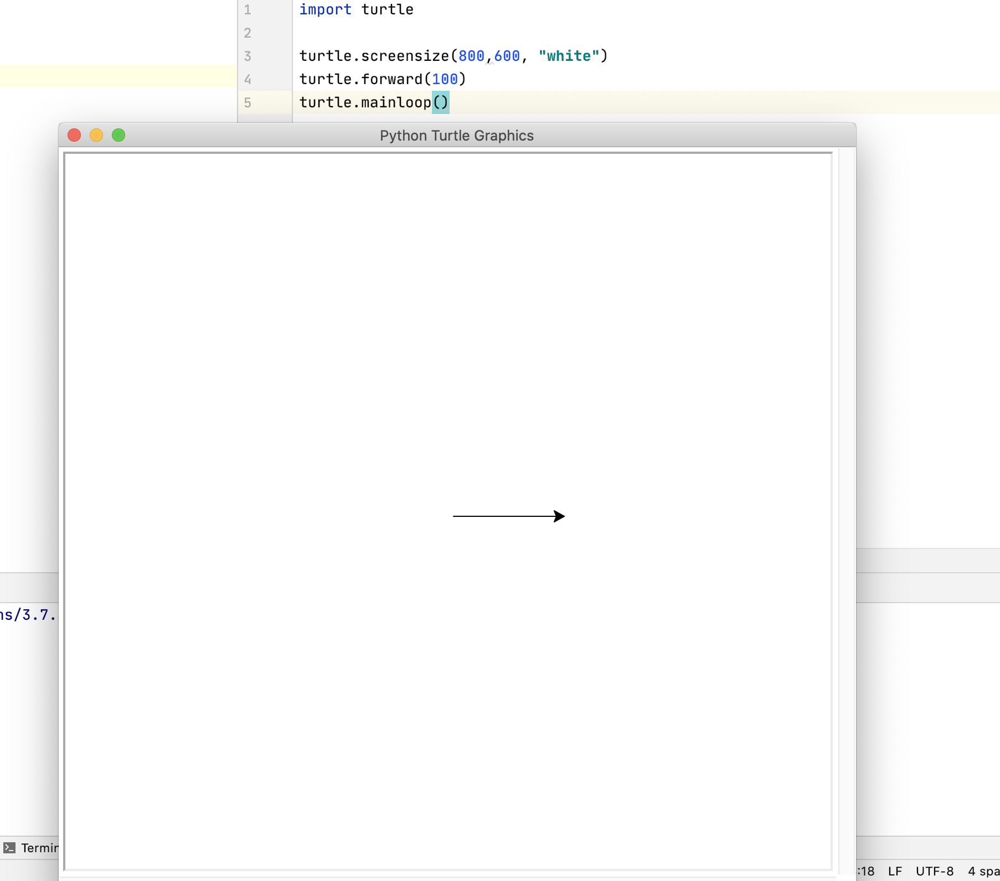

因为找了份兼职，说是要教小孩学turtle、pygame zero和codecombat，我一想turtle我熟啊，就想着把我turtle环境搭回来。本来以为在pycharm上安装一个turtle包就行了，没想到忙活了三天才在mac上装好。

# 第一个坑
因为mac是自带Python的，而且之前用起来一直都没什么问题，所以我以为`pip3 install turtle`自然而然就可以装好。但是当时在pycharm上装的时候报了Permission denied，我就傻了。然后退出去用命令行直接装turtle，发现pip3竟然对应的是Python2？这时我就意识到了Python版本太多带来的不便。
### 解决办法
问了问比较熟悉Python开发的好兄弟LL，他推荐给了我一个Python版本管理神器pyenv（我之前在老电脑上可能用过，但是不记得名字了），通过它可以解决Python版本过多的烦恼。
# 第二个坑
安装好pyenv后，我用`pyenv global`设置了Python版本，诶不对，为啥没起作用啊。。。还是系统默认版本啊

后来查了一下，才知道是因为系统调用Python的默认顺序是从Path中规定的，我虽然安装了pyenv但是它的优先级更低。好吧，继续找找解决办法。
### 解决办法
一开始看到了[https://www.jianshu.com/p/c2bc48fa9363](https://www.jianshu.com/p/c2bc48fa9363) 尝试了一下，但是make no sense。

后来又找到一篇文章[https://www.jianshu.com/p/7656896265ab](https://www.jianshu.com/p/7656896265ab) 用里面的指令打过去，然后重启终端，问题解决。
# 第三个坑
好了，我现在Python版本已经没问题了，现在可以给我安装turtle了吧！然后又`pip install turtle`，这次直接是安装turtle库失败了。

首先是连接问题，想安装Twisted的时候直接readTimeout，这个还算好解决的，我直接把Twisted下载下来，然后还让终端挂上Clash代理，最后Twisted就安装好了。

因为setup.py有一处地方用的是Python2的风格，但是我用的是Python3，编译没通过。（还好只有一个地方是这样，不幸中的万幸）
### 解决办法
这个解决办法网上已经很多了。因为我前天在Catalina上安装未果后当晚又在Windows上安装了一下，当时就只遇到了这个问题，而且解决也还蛮顺利的，所以遇到这个问题不是很怵头。

随便贴一个[https://blog.csdn.net/L_15156024189/article/details/86551245](https://blog.csdn.net/L_15156024189/article/details/86551245)
# 第四个坑
好了，现在该让我用turtle了吧？

什么，又报错了。。。我用turtle随便写了一个小例子，发现编译不通过，报错是这样的：`ModuleNotFoundError: No module named '_tkinter'`

其实这个问题我第一天安装的时候也遇到过，当时我看网上有人说是mac系统的Python不太行，我就以为是Catalina的锅，所以才想到换版本。没想到我绕了一圈，最后又回到最初的起点。。

### 解决办法
网上很多解决这个问题的办法，但是，它们都是用的`sudo apt-get install python3-tk`，这显然是个Linux系统的指令。

后来我看到了一个mac系统上的类似指令，`sudo port install python27-tk`，那我觉得是不是我安装好port指令，然后把python27改成python3就行了？但是我打不开macport的下载页面，于是我就去找与我有一洋之隔的WDT帮我下载。而且要安装macport，还必须要装有xcode和xcode的命令行？！没办法，我还把xcode也下了下来。

安装好之后：

？？？？？？？？？？？？？？？？？

看来这个办法是行不通的了，只能另辟蹊径。虽然网上铺天盖地的都是apt-get的解决办法（我就纳闷了，你们复制粘贴这么多一模一样的是想干啥？？？果然人类的本质就是复读机么），但是我也不知道自己是怎么做到找到mac系统的解决办法的。

解决办法一（没起作用）：[https://blog.csdn.net/gongchenyu/article/details/104515654](https://blog.csdn.net/gongchenyu/article/details/104515654)

解决办法二（起作用了，再次感谢WDT的海外援助，帮我下软件，救我狗命）：[https://www.jianshu.com/p/a6a8525c9535](https://www.jianshu.com/p/a6a8525c9535)

至此，turtle终于成功安装了。这次配环境真是一波三折，我感觉还是很有必要拿个博客记录一下的。那这篇博文也作为这个博客的处文贴上吧。

